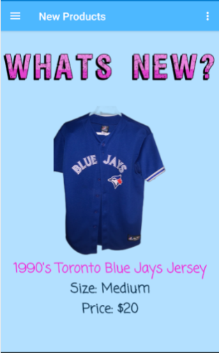

# Vince's Vintage Finds

Vince's Vintage Finds is a information resource for the store. It highlights sales and products and has a bonus way to save while in store.

# Getting Started

Overview of each section of the application:

Home: Features information about the business and the app 

New Products: Highlights products recently stocked 

Deals: All sales and promotions

About Us: FAQs

Contact Us: List of numorous ways to contact or find out more information about Vinc'es Vintage Finds

In Store Bonus: Feature bonus for in store shoppers. When ready to cash out at store, press the button and a coupon or try again will be shown.

# Prerequisites 

Android 6.0 Marshmellow

# Screenshots

# Author

Amanda Gayer

# Licenses

MIT License

Copyright (c) 2020 Amanda Gayer

Permission is hereby granted, free of charge, to any person obtaining a copy of this software and associated documentation files (the "Software"), to deal in the Software without restriction, including without limitation the rights to use, copy, modify, merge, publish, distribute, sublicense, and/or sell copies of the Software, and to permit persons to whom the Software is furnished to do so, subject to the following conditions:

The above copyright notice and this permission notice shall be included in all copies or substantial portions of the Software.

THE SOFTWARE IS PROVIDED "AS IS", WITHOUT WARRANTY OF ANY KIND, EXPRESS OR IMPLIED, INCLUDING BUT NOT LIMITED TO THE WARRANTIES OF MERCHANTABILITY, FITNESS FOR A PARTICULAR PURPOSE AND NONINFRINGEMENT. IN NO EVENT SHALL THE AUTHORS OR COPYRIGHT HOLDERS BE LIABLE FOR ANY CLAIM, DAMAGES OR OTHER LIABILITY, WHETHER IN AN ACTION OF CONTRACT, TORT OR OTHERWISE, ARISING FROM, OUT OF OR IN CONNECTION WITH THE SOFTWARE OR THE USE OR OTHER DEALINGS IN THE SOFTWARE.

# Acknowledgements

Thank you to all those who assisted in finding vintage clothes to make this possible, and to cfiliault who without, this project wouldn't have been possible.
